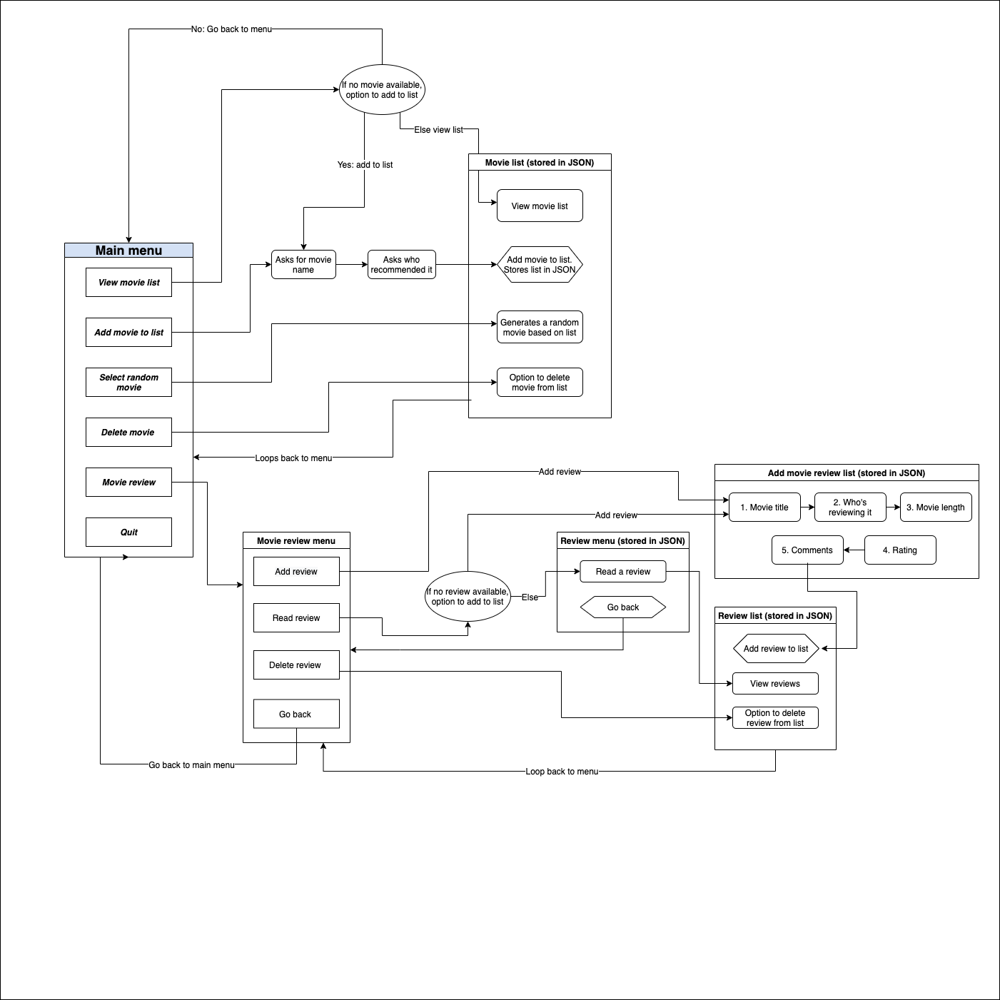

# Movie randomiser and reviewer

This is a simple application, that allows for users to create a movie watch list, randomly select a movie to watch, and allow users to create reviews about films they have watched.

## Installation and setup

**1. System requirement:**
Ensure that Ruby is installed on your local machine

**2. Download the application**
Here are the files needed for the application:
https://github.com/hey-chan/movie-randomiser-review

**3. Install Ruby gem dependencies:**
Open a command-line interface like *Terminal*, and enter `bundler -v` to install bundle

If not, enter `gem install bundler` to install.

Navigate to the ***src*** folder of Movie randomiser  project and enter `bundle install` to install all of the required gems.

**4. Run the application**
Ensure that you are within the **src** folder.

To run the application, either use:
`ruby movie_randomiser.rb` or `./movieapp.sh`

Nb. If you execute the program using `./movieapp.sh`, you may get an error message like:

"zsh: permission denied"

To override this message, simply execute `chmod +x ./movieapp.sh`

**5. Command line arguments**
Enter `./mybooks.sh -help` or `ruby movie_randomiser -help` to show helpful information about the app.

Use the following arguments after `./mybooks.sh` or `ruby movie_randomiser.rb`:
- ` -s list`: access movie watch list (if empty, this will prompt the user whether they want to add to watch list)
- ` -s add`: add to watch list
- ` -s random`: selects a random movie from the watch list
- ` -s reviews`: goes to movie review menu

**5. Screen size**
Ensure that your command-line interface is big enough to view the entire application. An appropriate dimension for this application is at least 90 x 30.

## Purpose and scope
The purpose of this application is to demonstrate the skills I have so far learnt with Ruby. 

My idea of creating a reviewed based application came from the weekly movie nights with friends. My thought was rather than spinning a wheel to determine the movie, I thought how could that process be automated, 

This application is primarily at movie lovers and regular movie watchers, particularly among social groups that want to decide what to watch.

It is a relative simple application, where a user has the option of simply adding a movie to a watch list, randomising that list and also allowing users to add or delete a review.

## User interaction (UI) and User experience (UX)
1. The application is rather simple, with extensive use of ascii art (in the form of a cinema screen) to exhance the experience. Most of the application's prompts will be displayed in the ascii art. 

1. The *rainbow* gem has been used as a way to improve and highlight particular aspects of the application

1. The *terminal-table* gem is used to compose the data neatly into a table. This is used for listing which movies have been reviewed, displaying reviews, and for showing movie watchlist

1. The *json* gem has been implemented to allow for files to be saved onto a local machine, and allowing for persistent data. This allows for the saved data to be viewed next time a user boots up this application

1. Conditionals have been applied to anticipate any potential errors, with the application displaying particular messages and how the user can handle them.

## Features
### ***1. Add a movie to a watch list or review***

This feature is pretty simple, allowing for users to add a movie that they wish to watch. 

### ***2. Randomise the watch list***
This will randomise whatever movie is on the watch list

### ***3. Conditional statements***
If there are no movies on the watch list when going through either *View movies to watch* or *Select a random movie from the watch list*,   then this message will display, and prompt whether users wish to add to that list. 

In addition, the application prevents any duplicate movies, and users will be notified if they wish to try again, or return to the main menu.

### ***4. Delete from movie list***
Users can delete a movie from the watch list after viewing it by typing it into the terminal application. Will prompt a user if a movie is not on the list. This feature is not case-sensitive. 

### ***5. Add, delete, and read movie reviews***
In addition to randomising movie choices, the application also allows for users to add their reviews about a specific movie. They can add, read or delete a review

## Implementation and planning
I have made use of Trello to assist with my planning. Here is a link to it

https://trello.com/b/GNSQFKpk/movierandomiserapp

## Control flow

## Application testing

Here are some of the features that have been tested.

https://docs.google.com/spreadsheets/d/e/2PACX-1vTVvnm2hQ-mbfwuHMV0XyF21tG0dFdGps-qusDndHCUQAVun0lZARfZ7rQAbiBYldh7O5o52AaW7DnX/pubhtml#

## References and dependencies
[json 2.5.0](https://rubygems.org/gems/json)

[rainbow 3.0.0](https://rubygems.org/gems/rainbow)

[terminal-table 3.0.0](https://rubygems.org/gems/terminal-table)

[tty-prompt 0.23.0](https://rubygems.org/gems/tty-prompt)